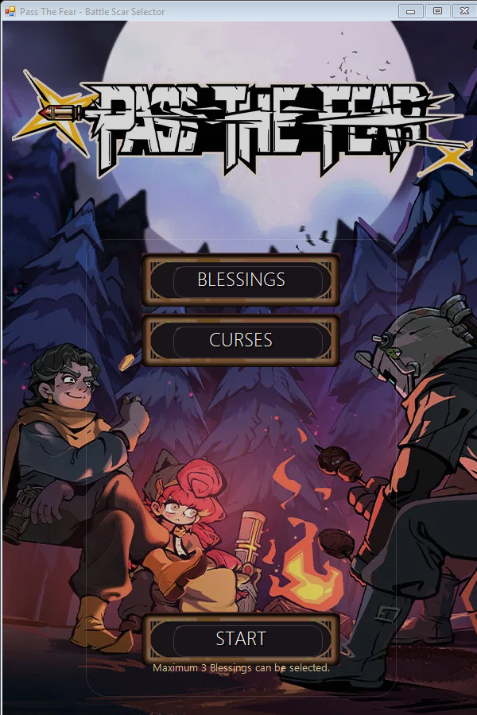
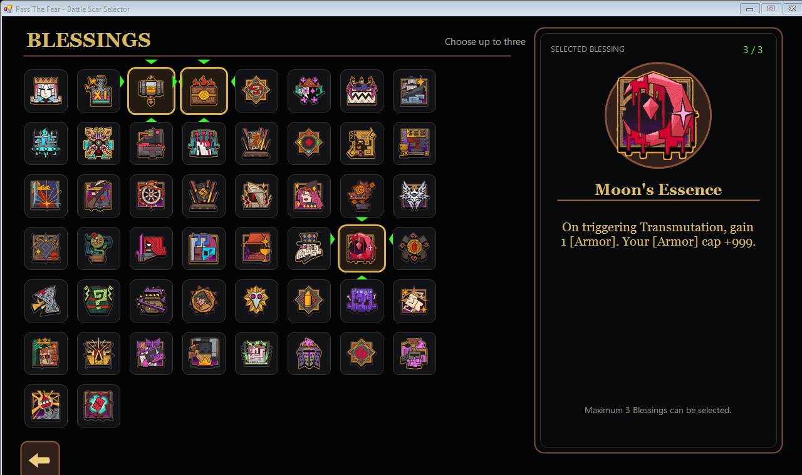
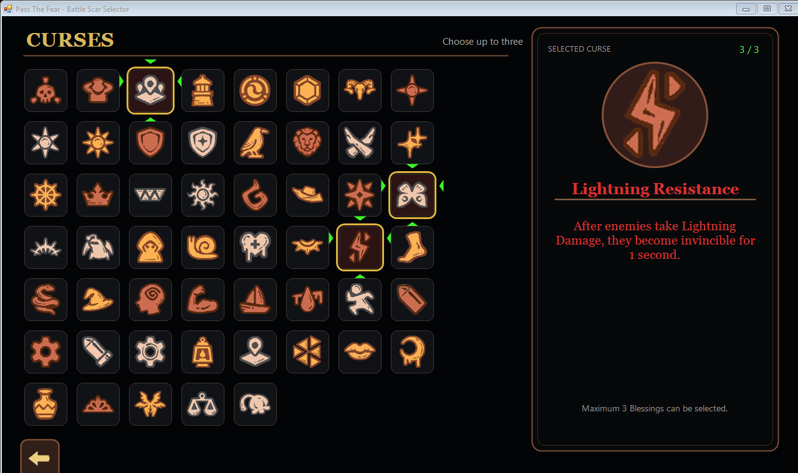

# Pass The Fear Battle Scar Selector

Choose a complete Battle Scar loadout for *Pass The Fear* before a run. The selector presents every available Blessing and Curse with its icon and effect text, then the companion BepInEx plugin applies the six selected IDs when the next run starts.

## Quick start for players

1. Install **BepInEx 6 IL2CPP x64** in your own *Pass The Fear* folder, then launch the game once so BepInEx can finish its first-run setup.[official BepInEx IL2CPP](https://builds.bepinex.dev/projects/bepinex_be)

2. Download these two files from [`dist/`](dist):
   - [`BattleScarSelector.exe`](dist/BattleScarSelector.exe)
   - [`PassTheFearBattleScarSelector.dll`](dist/PassTheFearBattleScarSelector.dll)
   
3. Create the folder `BepInEx/plugins/PassTheFearBattleScarSelector` inside the game folder and place both files there.

4. Run `BattleScarSelector.exe` from that folder while the game is closed.

5. Select three Blessings and three Curses, then press **Start**. The selector saves the loadout beside the plugin DLL.

6. Launch the game normally. BepInEx reads the saved loadout at the beginning of the next run.

The selector does not launch the game for you. The executable already contains the catalogue, IDs, descriptions, and icons, so no separate data or icon files are needed.

## Screenshots

### Home screen

### Blessings screen

### Curses screen

## Requirements

For the prebuilt player package:

- Windows x64.
- BepInEx 6 IL2CPP x64 installed in that game folder.
- .NET Framework 4.8 or later for the standalone selector.

## Troubleshooting

- **Start is locked:** select three Blessings and three Curses first. A partial loadout cannot be saved.
- **The game starts but the loadout is unchanged:** confirm that both files are in `BepInEx/plugins/PassTheFearBattleScarSelector`, then launch the selector from that same folder and start the game after saving.
- **The selector cannot find the plugin folder:** do not run the executable from a separate download folder; keep it beside `PassTheFearBattleScarSelector.dll`.
- **The selector does not open:** install or repair .NET Framework 4.8, then try again while the game is closed.

